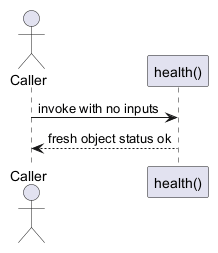

# Pure health function architecture

Architecture identity: sample-api
Architecture version: 1.0.0

## Contents

- [ARCH-001 Context and goals](#arch-001)
- [ARCH-010 Boundaries and contracts](#arch-010)
- [ARCH-020 Testing and integration](#arch-020)

## Requirements

- Export health() from src/health.mjs with no inputs and fresh {"status":"ok"} result.
- Use Node built-in tests and preserve the existing package test command.

## Constraints

- Pure function; no I/O and no added dependencies.

## Non-goals

- HTTP services, gateways, databases and access-control deployment are outside this task.

## Assumptions

- Node.js executes ES modules.

## Risks

- Callers must not assume this function checks external dependencies.

## External dependencies

- Node.js runtime

## Rejected alternatives

- An HTTP service is unnecessary for this accepted function-only task.

## Decisions

- Decision DEC-001 [accepted]: Export health() from src/health.mjs returning a fresh status-ok object without inputs.

## ARCH-001 Context and goals

A caller invokes health() to receive a pure status-ok result. No service or deployment architecture is introduced.

Rationale: The accepted function-only scope needs no infrastructure.

Trade-offs: No external dependency health checks.

## ARCH-010 Boundaries and contracts

AS-IS: package test entry exists, implementation pending. TARGET: export health() from src/health.mjs, no inputs, a fresh object exactly {"status":"ok"}. No I/O, dependencies or HTTP behavior. KNOWN DEVIATION: source and tests pending.

## ARCH-020 Testing and integration

Node built-in tests at tests/health.test.mjs verify result shape and fresh objects. Preserve node --test tests/health.test.mjs. Governance controls task worktree, independent review, canonical integration and progress. GitHub CI validates fixture behavior through the suite PR.

### Diagram health-sequence | ARCH-010

Source: [PlantUML](diagrams/health-sequence.puml)

