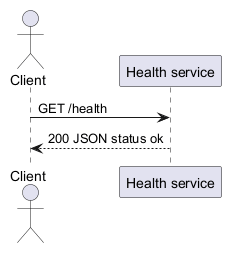

# 架构治理与健康检查

Architecture identity: sample-api
Architecture version: 1.0.0

## Contents

- [ARCH-001 Context and goals](#arch-001)
- [ARCH-010 Boundaries and contracts](#arch-010)
- [ARCH-020 Deployment and testing](#arch-020)

## Requirements

- Provide deterministic health JSON.

## Constraints

- One stateless service.

## Non-goals

- No database or authentication in this health-only task.

## Assumptions

- Internal gateway controls access.

## Risks

- Verify gateway before public exposure.

## External dependencies

- Node.js

## Rejected alternatives

- Database-backed health checks are unnecessary.

## Decisions

- Decision DEC-001 [accepted]: A single service owns health.

## ARCH-001 Context and goals

当前系统只实现明确的健康检查需求，保持最小可靠实现。当前系统只实现明确的健康检查需求，保持最小可靠实现。当前系统只实现明确的健康检查需求，保持最小可靠实现。当前系统只实现明确的健康检查需求，保持最小可靠实现。当前系统只实现明确的健康检查需求，保持最小可靠实现。当前系统只实现明确的健康检查需求，保持最小可靠实现。当前系统只实现明确的健康检查需求，保持最小可靠实现。当前系统只实现明确的健康检查需求，保持最小可靠实现。当前系统只实现明确的健康检查需求，保持最小可靠实现。当前系统只实现明确的健康检查需求，保持最小可靠实现。当前系统只实现明确的健康检查需求，保持最小可靠实现。当前系统只实现明确的健康检查需求，保持最小可靠实现。当前系统只实现明确的健康检查需求，保持最小可靠实现。当前系统只实现明确的健康检查需求，保持最小可靠实现。当前系统只实现明确的健康检查需求，保持最小可靠实现。当前系统只实现明确的健康检查需求，保持最小可靠实现。当前系统只实现明确的健康检查需求，保持最小可靠实现。当前系统只实现明确的健康检查需求，保持最小可靠实现。当前系统只实现明确的健康检查需求，保持最小可靠实现。当前系统只实现明确的健康检查需求，保持最小可靠实现。当前系统只实现明确的健康检查需求，保持最小可靠实现。当前系统只实现明确的健康检查需求，保持最小可靠实现。当前系统只实现明确的健康检查需求，保持最小可靠实现。当前系统只实现明确的健康检查需求，保持最小可靠实现。当前系统只实现明确的健康检查需求，保持最小可靠实现。当前系统只实现明确的健康检查需求，保持最小可靠实现。当前系统只实现明确的健康检查需求，保持最小可靠实现。当前系统只实现明确的健康检查需求，保持最小可靠实现。当前系统只实现明确的健康检查需求，保持最小可靠实现。当前系统只实现明确的健康检查需求，保持最小可靠实现。当前系统只实现明确的健康检查需求，保持最小可靠实现。当前系统只实现明确的健康检查需求，保持最小可靠实现。当前系统只实现明确的健康检查需求，保持最小可靠实现。当前系统只实现明确的健康检查需求，保持最小可靠实现。当前系统只实现明确的健康检查需求，保持最小可靠实现。当前系统只实现明确的健康检查需求，保持最小可靠实现。当前系统只实现明确的健康检查需求，保持最小可靠实现。当前系统只实现明确的健康检查需求，保持最小可靠实现。当前系统只实现明确的健康检查需求，保持最小可靠实现。当前系统只实现明确的健康检查需求，保持最小可靠实现。当前系统只实现明确的健康检查需求，保持最小可靠实现。当前系统只实现明确的健康检查需求，保持最小可靠实现。当前系统只实现明确的健康检查需求，保持最小可靠实现。当前系统只实现明确的健康检查需求，保持最小可靠实现。当前系统只实现明确的健康检查需求，保持最小可靠实现。当前系统只实现明确的健康检查需求，保持最小可靠实现。当前系统只实现明确的健康检查需求，保持最小可靠实现。当前系统只实现明确的健康检查需求，保持最小可靠实现。当前系统只实现明确的健康检查需求，保持最小可靠实现。当前系统只实现明确的健康检查需求，保持最小可靠实现。当前系统只实现明确的健康检查需求，保持最小可靠实现。当前系统只实现明确的健康检查需求，保持最小可靠实现。当前系统只实现明确的健康检查需求，保持最小可靠实现。当前系统只实现明确的健康检查需求，保持最小可靠实现。当前系统只实现明确的健康检查需求，保持最小可靠实现。当前系统只实现明确的健康检查需求，保持最小可靠实现。当前系统只实现明确的健康检查需求，保持最小可靠实现。当前系统只实现明确的健康检查需求，保持最小可靠实现。当前系统只实现明确的健康检查需求，保持最小可靠实现。当前系统只实现明确的健康检查需求，保持最小可靠实现。当前系统只实现明确的健康检查需求，保持最小可靠实现。当前系统只实现明确的健康检查需求，保持最小可靠实现。当前系统只实现明确的健康检查需求，保持最小可靠实现。当前系统只实现明确的健康检查需求，保持最小可靠实现。当前系统只实现明确的健康检查需求，保持最小可靠实现。当前系统只实现明确的健康检查需求，保持最小可靠实现。当前系统只实现明确的健康检查需求，保持最小可靠实现。当前系统只实现明确的健康检查需求，保持最小可靠实现。当前系统只实现明确的健康检查需求，保持最小可靠实现。当前系统只实现明确的健康检查需求，保持最小可靠实现。当前系统只实现明确的健康检查需求，保持最小可靠实现。当前系统只实现明确的健康检查需求，保持最小可靠实现。当前系统只实现明确的健康检查需求，保持最小可靠实现。当前系统只实现明确的健康检查需求，保持最小可靠实现。当前系统只实现明确的健康检查需求，保持最小可靠实现。当前系统只实现明确的健康检查需求，保持最小可靠实现。当前系统只实现明确的健康检查需求，保持最小可靠实现。当前系统只实现明确的健康检查需求，保持最小可靠实现。当前系统只实现明确的健康检查需求，保持最小可靠实现。当前系统只实现明确的健康检查需求，保持最小可靠实现。当前系统只实现明确的健康检查需求，保持最小可靠实现。当前系统只实现明确的健康检查需求，保持最小可靠实现。当前系统只实现明确的健康检查需求，保持最小可靠实现。当前系统只实现明确的健康检查需求，保持最小可靠实现。当前系统只实现明确的健康检查需求，保持最小可靠实现。当前系统只实现明确的健康检查需求，保持最小可靠实现。当前系统只实现明确的健康检查需求，保持最小可靠实现。当前系统只实现明确的健康检查需求，保持最小可靠实现。当前系统只实现明确的健康检查需求，保持最小可靠实现。当前系统只实现明确的健康检查需求，保持最小可靠实现。当前系统只实现明确的健康检查需求，保持最小可靠实现。当前系统只实现明确的健康检查需求，保持最小可靠实现。当前系统只实现明确的健康检查需求，保持最小可靠实现。当前系统只实现明确的健康检查需求，保持最小可靠实现。当前系统只实现明确的健康检查需求，保持最小可靠实现。当前系统只实现明确的健康检查需求，保持最小可靠实现。当前系统只实现明确的健康检查需求，保持最小可靠实现。当前系统只实现明确的健康检查需求，保持最小可靠实现。当前系统只实现明确的健康检查需求，保持最小可靠实现。当前系统只实现明确的健康检查需求，保持最小可靠实现。

Rationale: Small stateless component meets accepted requirements.

Trade-offs: No dependency aggregation.

## ARCH-010 Boundaries and contracts

AS-IS: empty app. TARGET: GET /health returns HTTP 200 with application/json and status ok. KNOWN DEVIATION: implementation pending. Errors use HTTP 500 without retries.

## ARCH-020 Deployment and testing

One Node.js service behind gateway. Rollback to previous release. Local and CI use the same validation contract.

### Diagram health-sequence | ARCH-010

Source: [PlantUML](diagrams/health-sequence.puml)

