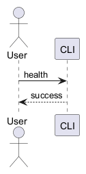

# 本地健康检查架构

Architecture identity: health-fixture
Architecture version: 2.0.0

## Contents

- [ARCH-001 CLI scope](#arch-001)
- [ARCH-010 Local contract](#arch-010)
- [ARCH-020 Validation](#arch-020)

## Requirements

- Provide deterministic local health JSON.

## Constraints

- A CLI tool, no server or GUI.

## Non-goals

- No database, middleware or gateway.

## External dependencies

- Node.js

## Rejected alternatives

- HTTP service excluded from this fixture.

## Decisions

- Decision DEC-001 [accepted]: Node CLI without framework

## ARCH-001 CLI scope

用户执行本地命令获取健康状态，返回确定的 JSON 结果。项目不引入服务器、界面、数据库或网关。用户执行本地命令获取健康状态，返回确定的 JSON 结果。项目不引入服务器、界面、数据库或网关。用户执行本地命令获取健康状态，返回确定的 JSON 结果。项目不引入服务器、界面、数据库或网关。用户执行本地命令获取健康状态，返回确定的 JSON 结果。项目不引入服务器、界面、数据库或网关。用户执行本地命令获取健康状态，返回确定的 JSON 结果。项目不引入服务器、界面、数据库或网关。用户执行本地命令获取健康状态，返回确定的 JSON 结果。项目不引入服务器、界面、数据库或网关。用户执行本地命令获取健康状态，返回确定的 JSON 结果。项目不引入服务器、界面、数据库或网关。用户执行本地命令获取健康状态，返回确定的 JSON 结果。项目不引入服务器、界面、数据库或网关。用户执行本地命令获取健康状态，返回确定的 JSON 结果。项目不引入服务器、界面、数据库或网关。用户执行本地命令获取健康状态，返回确定的 JSON 结果。项目不引入服务器、界面、数据库或网关。用户执行本地命令获取健康状态，返回确定的 JSON 结果。项目不引入服务器、界面、数据库或网关。用户执行本地命令获取健康状态，返回确定的 JSON 结果。项目不引入服务器、界面、数据库或网关。用户执行本地命令获取健康状态，返回确定的 JSON 结果。项目不引入服务器、界面、数据库或网关。用户执行本地命令获取健康状态，返回确定的 JSON 结果。项目不引入服务器、界面、数据库或网关。用户执行本地命令获取健康状态，返回确定的 JSON 结果。项目不引入服务器、界面、数据库或网关。用户执行本地命令获取健康状态，返回确定的 JSON 结果。项目不引入服务器、界面、数据库或网关。用户执行本地命令获取健康状态，返回确定的 JSON 结果。项目不引入服务器、界面、数据库或网关。用户执行本地命令获取健康状态，返回确定的 JSON 结果。项目不引入服务器、界面、数据库或网关。用户执行本地命令获取健康状态，返回确定的 JSON 结果。项目不引入服务器、界面、数据库或网关。用户执行本地命令获取健康状态，返回确定的 JSON 结果。项目不引入服务器、界面、数据库或网关。用户执行本地命令获取健康状态，返回确定的 JSON 结果。项目不引入服务器、界面、数据库或网关。用户执行本地命令获取健康状态，返回确定的 JSON 结果。项目不引入服务器、界面、数据库或网关。用户执行本地命令获取健康状态，返回确定的 JSON 结果。项目不引入服务器、界面、数据库或网关。用户执行本地命令获取健康状态，返回确定的 JSON 结果。项目不引入服务器、界面、数据库或网关。用户执行本地命令获取健康状态，返回确定的 JSON 结果。项目不引入服务器、界面、数据库或网关。用户执行本地命令获取健康状态，返回确定的 JSON 结果。项目不引入服务器、界面、数据库或网关。用户执行本地命令获取健康状态，返回确定的 JSON 结果。项目不引入服务器、界面、数据库或网关。用户执行本地命令获取健康状态，返回确定的 JSON 结果。项目不引入服务器、界面、数据库或网关。用户执行本地命令获取健康状态，返回确定的 JSON 结果。项目不引入服务器、界面、数据库或网关。用户执行本地命令获取健康状态，返回确定的 JSON 结果。项目不引入服务器、界面、数据库或网关。用户执行本地命令获取健康状态，返回确定的 JSON 结果。项目不引入服务器、界面、数据库或网关。用户执行本地命令获取健康状态，返回确定的 JSON 结果。项目不引入服务器、界面、数据库或网关。用户执行本地命令获取健康状态，返回确定的 JSON 结果。项目不引入服务器、界面、数据库或网关。用户执行本地命令获取健康状态，返回确定的 JSON 结果。项目不引入服务器、界面、数据库或网关。用户执行本地命令获取健康状态，返回确定的 JSON 结果。项目不引入服务器、界面、数据库或网关。用户执行本地命令获取健康状态，返回确定的 JSON 结果。项目不引入服务器、界面、数据库或网关。用户执行本地命令获取健康状态，返回确定的 JSON 结果。项目不引入服务器、界面、数据库或网关。用户执行本地命令获取健康状态，返回确定的 JSON 结果。项目不引入服务器、界面、数据库或网关。用户执行本地命令获取健康状态，返回确定的 JSON 结果。项目不引入服务器、界面、数据库或网关。用户执行本地命令获取健康状态，返回确定的 JSON 结果。项目不引入服务器、界面、数据库或网关。用户执行本地命令获取健康状态，返回确定的 JSON 结果。项目不引入服务器、界面、数据库或网关。用户执行本地命令获取健康状态，返回确定的 JSON 结果。项目不引入服务器、界面、数据库或网关。用户执行本地命令获取健康状态，返回确定的 JSON 结果。项目不引入服务器、界面、数据库或网关。用户执行本地命令获取健康状态，返回确定的 JSON 结果。项目不引入服务器、界面、数据库或网关。用户执行本地命令获取健康状态，返回确定的 JSON 结果。项目不引入服务器、界面、数据库或网关。用户执行本地命令获取健康状态，返回确定的 JSON 结果。项目不引入服务器、界面、数据库或网关。用户执行本地命令获取健康状态，返回确定的 JSON 结果。项目不引入服务器、界面、数据库或网关。用户执行本地命令获取健康状态，返回确定的 JSON 结果。项目不引入服务器、界面、数据库或网关。用户执行本地命令获取健康状态，返回确定的 JSON 结果。项目不引入服务器、界面、数据库或网关。用户执行本地命令获取健康状态，返回确定的 JSON 结果。项目不引入服务器、界面、数据库或网关。用户执行本地命令获取健康状态，返回确定的 JSON 结果。项目不引入服务器、界面、数据库或网关。用户执行本地命令获取健康状态，返回确定的 JSON 结果。项目不引入服务器、界面、数据库或网关。用户执行本地命令获取健康状态，返回确定的 JSON 结果。项目不引入服务器、界面、数据库或网关。用户执行本地命令获取健康状态，返回确定的 JSON 结果。项目不引入服务器、界面、数据库或网关。用户执行本地命令获取健康状态，返回确定的 JSON 结果。项目不引入服务器、界面、数据库或网关。用户执行本地命令获取健康状态，返回确定的 JSON 结果。项目不引入服务器、界面、数据库或网关。用户执行本地命令获取健康状态，返回确定的 JSON 结果。项目不引入服务器、界面、数据库或网关。用户执行本地命令获取健康状态，返回确定的 JSON 结果。项目不引入服务器、界面、数据库或网关。用户执行本地命令获取健康状态，返回确定的 JSON 结果。项目不引入服务器、界面、数据库或网关。用户执行本地命令获取健康状态，返回确定的 JSON 结果。项目不引入服务器、界面、数据库或网关。用户执行本地命令获取健康状态，返回确定的 JSON 结果。项目不引入服务器、界面、数据库或网关。用户执行本地命令获取健康状态，返回确定的 JSON 结果。项目不引入服务器、界面、数据库或网关。用户执行本地命令获取健康状态，返回确定的 JSON 结果。项目不引入服务器、界面、数据库或网关。用户执行本地命令获取健康状态，返回确定的 JSON 结果。项目不引入服务器、界面、数据库或网关。用户执行本地命令获取健康状态，返回确定的 JSON 结果。项目不引入服务器、界面、数据库或网关。用户执行本地命令获取健康状态，返回确定的 JSON 结果。项目不引入服务器、界面、数据库或网关。用户执行本地命令获取健康状态，返回确定的 JSON 结果。项目不引入服务器、界面、数据库或网关。用户执行本地命令获取健康状态，返回确定的 JSON 结果。项目不引入服务器、界面、数据库或网关。用户执行本地命令获取健康状态，返回确定的 JSON 结果。项目不引入服务器、界面、数据库或网关。用户执行本地命令获取健康状态，返回确定的 JSON 结果。项目不引入服务器、界面、数据库或网关。用户执行本地命令获取健康状态，返回确定的 JSON 结果。项目不引入服务器、界面、数据库或网关。用户执行本地命令获取健康状态，返回确定的 JSON 结果。项目不引入服务器、界面、数据库或网关。用户执行本地命令获取健康状态，返回确定的 JSON 结果。项目不引入服务器、界面、数据库或网关。用户执行本地命令获取健康状态，返回确定的 JSON 结果。项目不引入服务器、界面、数据库或网关。用户执行本地命令获取健康状态，返回确定的 JSON 结果。项目不引入服务器、界面、数据库或网关。

## ARCH-010 Local contract

The command returns status ok on success. Failures return a nonzero process code with a diagnostic. No network API is introduced.

## ARCH-020 Validation

Node tests validate the local command. The same validation contract runs locally and in CI.

### Diagram health-sequence | ARCH-010

Source: [PlantUML](diagrams/health-sequence.puml)

